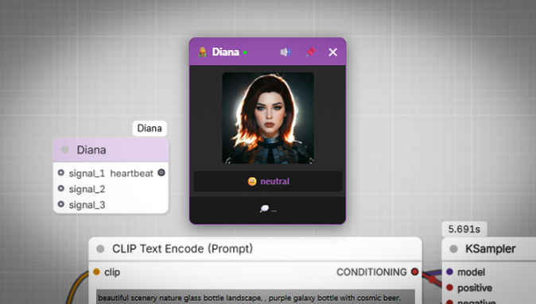

# 🧝 Diana - Interactive Assistant for ComfyUI (Alpha)



Meet Diana - your virtual assistant that brings personality to ComfyUI! She reacts to generation events, displays emotions, speaks phrases, and adds a touch of magic to your workflow.

✨ Current Features (Alpha)
🎭 5 Unique Emotions: neutral, waiting, speaking, happy, surprised

🗣️ Voice Reactions: Plays audio on events (start, complete, error)

💬 Random Phrases: Context-aware phrases for each event

🖱️ Interactive: Drag her around - she gets surprised!

🔌 Always Active: Once loaded, Diana works in EVERY workflow

🎨 Beautiful UI: Purple-themed floating window with status indicator

📍 Pinnable: Pin to corner or move freely

# 📦 Installation

```bash
cd ComfyUI/custom_nodes/
git clone https://github.com/yourusername/comfyui-diana.git
```

# 🚀 First Run (IMPORTANT!)
Diana needs to be loaded once per ComfyUI session!

✅ Create a new workflow (File → New)

✅ Add Diana node (Right-click → Add Node → diana → Diana)

✅ Run the workflow (just Queue Prompt with empty graph)

✅ Diana window will appear with purple border

✅ Click anywhere on the page to activate sound

✅ Diana is now alive and will work in ALL workflows!

After this one-time setup, you can remove Diana node from any workflow - she'll keep working!

# 🎯 How to Use
Basic Usage
Just work with ComfyUI as usual

Diana will react to:

🎬 Start → speaking emotion + "Starting the magic..."

✅ Complete → happy emotion + "Another masterpiece is born!"

❌ Error → surprised emotion + "Oops! Something went wrong."

⏳ Waiting → waiting emotion (during long gens)

Window Controls
🔇 Sound button: Click to enable/disable audio (first click activates)

📌 Pin button: Pin to corner or free movement

✕ Close: Hide Diana (reopen by reloading page)

# 📝 Requirements
ComfyUI (any version)

Modern browser with JavaScript enabled

Audio enabled browser (for sound)

# 🔧 Troubleshooting
Diana window doesn't appear
Make sure you've done the First Run step

Check browser console (F12) for errors

Verify diana.lib exists in the folder

No sound
Click anywhere on the page to enable audio

Check if browser blocks autoplay

Click the sound button (turns green when active)

Events not working
Diana needs to be activated once per session

Check Python console for "[Diana] ✅ Event hooks installed"

Reload the page and try again

# 🤝 Contributing
This is an Alpha release - expect bugs and frequent updates! Feel free to:

Report issues

Suggest features

Create new emotion sets

Submit PRs!

# 📜 License
MIT License - feel free to use, modify, and share!

# 🙏 Acknowledgments
Created with ❤️ by Rimor.
Special thanks to the ComfyUI community!

